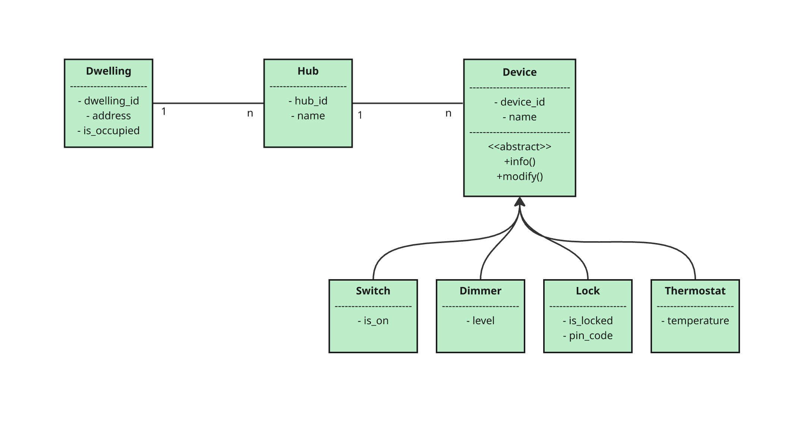

# IoT Manager

A Python package providing an in-memory model for dwellings, hubs, and devices in a smart-home ecosystem.

## Installation

Using pip:

```bash
pip install .          # regular install
pip install -e .       # editable/development mode
pip install .[dev]     # install dev deps
```

Or with Poetry:

```bash
poetry install
```

## Usage
As a library

```bash
from classes.iot_manager import IoTManager
from classes.devices import Switch, Dimmer, Lock, Thermostat
from classes.hub import Hub
from classes.dwelling import Dwelling

mgr = IoTManager()
mgr.create_dwelling("home1", "123 Main St")
dw = mgr.get_dwelling("home1")

hub = Hub("hub1", "Living Room Hub")
dw.install_hub(hub)

sw = Switch("dev1", "Porch Light")
hub.pair_device(sw)
sw.modify(is_on=True)

print(hub.list_devices())
```

Example script
```bash
python main.py
```

## Testing and linting

Run tests

```bash
pytest
```

Auto-format code

```bash
black .
isort .
ruff --fix .
```

Run linter

```bash
pylint classes tests
```

## Project Structure
```bash

./
├── classes/             # Production package
│   ├── __init__.py
│   ├── devices.py
│   ├── hub.py
│   ├── dwelling.py
│   └── iot_manager.py
├── tests/               # Test suite (pytest)
│   ├── __init__.py
│   ├── test_devices.py
│   ├── test_hub.py
│   ├── test_dwelling.py
│   └── test_iot_manager.py
├── main.py              # Example entry point
├── pyproject.toml       # Build & dev-deps config
└── README.md            # This file
```

